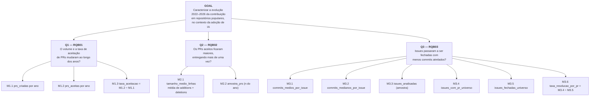

# Relatório: Laboratório de Experimentação de Software

| Campo | Valor |
|---|---|
| **Curso** | Engenharia de Software |
| **Disciplina** | Laboratório de Experimentação de Software |
| **Turno / Período** | Noite / 6º |
| **Professor(a)** | Danilo Maia |
| **Laboratório** | Lab01 Características de Repositórios Populares + Setup do Kanban |
| **Grupo (trio)** | Bruna Costa · Pedro Luiz· Thiago Branco |
| **Link do repositório / GitHub Projects** | [Projects](https://github.com/users/Brunamark/projects/5)  |
| **Data de entrega** | 27/08/2026|

---

## 1. Introdução

Sistemas open-source populares concentram grande parte da atenção da comunidade de engenharia de software, mas as características que de fato os tornam populares, maturidade, ritmo de contribuição externa, frequência de lançamentos, atualização e escolha de linguagem, nem sempre são evidentes sem uma análise sistemática. Este laboratório analisa uma amostra de **1.000 repositórios populares** do GitHub, respondendo às sete Questões de Pesquisa (RQ01–RQ07) definidas no enunciado na medida em que os atributos foram coletados, além de três Questões de Pesquisa Bônus (RQB01–RQB03) que investigam o impacto da adoção de ferramentas de Inteligência Artificial na cultura de desenvolvimento.

As Questões de Pesquisa do enunciado são:

- **RQ01.** Sistemas populares são maduros/antigos? (idade do repositório)
- **RQ02.** Sistemas populares recebem muita contribuição externa? (total de pull requests aceitas)
- **RQ03.** Sistemas populares lançam releases com frequência? (total de releases)
- **RQ04.** Sistemas populares são atualizados com frequência? (tempo até a última atualização)
- **RQ05.** Sistemas populares são escritos nas linguagens mais populares? (linguagem primária)
- **RQ06.** Sistemas populares possuem um alto percentual de issues fechadas? (razão issues fechadas/total)
- **RQ07.** Sistemas em linguagens mais populares recebem mais contribuição, lançam mais releases e são atualizados com mais frequência? (RQ02, RQ03 e RQ04 por linguagem)

Hipóteses informais do grupo, confrontadas com a amostra disponível:

- **RQ01:** espera-se que os repositórios populares tenham histórico relativamente longo.
- **RQ02:** espera-se que repositórios populares apresentem contribuição externa relevante.
- **RQ03:** espera-se que a maioria possua releases, embora com frequências diferentes.
- **RQ04:** espera-se que a maior parte tenha recebido push recentemente.
- **RQ05:** espera-se que as linguagens observadas estejam entre as mais utilizadas no ecossistema.
- **RQ06:** espera-se que uma parcela relevante das issues esteja fechada.
- **RQ07:** espera-se que as métricas de contribuição, releases e atualização variem entre linguagens.

As hipóteses de RQ05, RQ06 e RQ07 não podem ser confrontadas com este arquivo, pois seus atributos (linguagem primária, issues fechadas/total) não estão presentes no CSV de repositórios. A RQ02 é parcialmente endereçada pelos dados agregados de PRs da RQB01.

Além do enunciado, o grupo propôs duas Questões de Pesquisa de Validação (RQV1 e RQV2) e três Questões de Pesquisa Bônus (RQB01, RQB02 e RQB03). As de primeiro tipo são voltadas não às características dos repositórios em si, mas à confiabilidade do próprio pipeline de coleta de dados construído para responder às RQ01–RQ07, já as segundas buscam analisar impactos na adoção de ferramentas de Inteligência Artificial à cultura de desenvolvimento. Seguem as questões em detalhe:

- **RQV01** — A extração via API GraphQL do GitHub cobre a totalidade dos itens esperados, sem lacunas de paginação, e produz resultados idênticos em execuções repetidas nas mesmas condições?
- **RQV02** — A extração via API GraphQL do GitHub evita chamadas HTTP redundantes e recupera-se corretamente de falhas transitórias (5xx) via retry, sem contabilizar a tentativa de recuperação como uma chamada redundante?
- **RQB01** — Com enfoque em criação e aceitação de Pull Requests, como a adoção de ferramentas de Inteligência Artificial tem impactado contribuições em projetos open-source nos últimos quatro anos?
- **RQB02** — Com o auxílio de ferramentas de Inteligência Artificial, nos últimos quatro anos, Pull Requests têm tido um aumento em quantidade de linhas de código, consequentemente atendendo um maior número de pendências de uma vez?
- **RQB03** — Como consequência da agilização do processo de desenvolvimento, fruto do uso de IAs, issues têm sido fechadas com uma menor quantidade de commits atrelados?

O detalhamento da metodologia usada para validação dos requisitos adicionais se encontra na Seção 3.6.

---

## 2. Contexto

Este relatório documenta o Lab01 da disciplina, primeiro laboratório do semestre, que também dá início ao uso do GitHub Projects (v2) como quadro Kanban do grupo, mantido até o Lab05. O objeto de estudo é uma amostra de 1.000 repositórios populares do GitHub, minerados via API GraphQL complementada por chamadas REST. Os arquivos analisados são [repositorios_top100.csv](../lab01-coleta/repositorios_top100.csv), [tendencia_prs.csv](../lab01-coleta/tendencia_prs.csv), [tendencia_tamanho_prs.csv](../lab01-coleta/tendencia_tamanho_prs.csv) e [commits_por_issue.csv](../lab01-coleta/commits_por_issue.csv).

Como o CSV de repositórios não possui a linguagem primária, RQ05 e RQ07 não são respondidas nesta versão do relatório. Consequentemente, não foi necessário selecionar uma fonte externa de ranking de linguagens para interpretar os dados disponíveis.

Como base metodológica para a validação da confiabilidade do pipeline de coleta (RQV01 e RQV02), o grupo utilizou cenários de teste de comportamento (BDD) escritos em Cucumber/Gherkin, executados contra a API real do GitHub sob o perfil `realtest`, tratando o próprio processo de extração de dados como objeto de verificação, e não apenas os dados extraídos.

---

## 3. Metodologia

### 3.1 Principais Desafios

- Limite de taxa (rate limit) da API do GitHub ao consultar a amostra de 1.000 repositórios.
- Paginação de grandes volumes de dados, exigindo verificação explícita de que o laço de coleta respeita o indicador `hasNextPage` sem gerar chamadas adicionais após seu término.
- Falhas transitórias (respostas 5xx) não são reproduzíveis de forma determinística contra a API real: não é possível garantir que uma página específica falhará com `502` na primeira tentativa, o que limitou a validação empírica do mecanismo de retry a um cenário de execução sem falhas.
- Mistura de registros no `CallLog`: como o cenário de idempotência compara duas execuções da mesma coleta usando o mesmo registro de chamadas, a métrica de redundância passa a misturar a repetição esperada da segunda execução com possíveis duplicidades internas, exigindo leitura cuidadosa por execução lógica.
- Divergências observadas em execuções anteriores entre o XML do Cucumber e o resumo do Surefire, exigindo que os artefatos de relatório sejam sempre coletados a partir da mesma execução antes de qualquer comparação.
- Ausência de histórico de mudança de status consultável via API no GitHub Projects, exigindo snapshots manuais recorrentes a cada sprint.

### 3.2 Tomadas de Decisão

- O cenário original que induzia uma resposta `502` determinística foi substituído por um cenário de execução real sem falhas, já que a API real do GitHub não permite garantir a ocorrência controlada de um erro 502 na primeira tentativa, a recuperação determinística desse caso não é apresentada como evidência validada nesta execução.
- As métricas de validação do pipeline (`total_chamadas`, `chamadas_unicas`, `chamadas_redundantes`, `tentativas_de_retry`, `taxa_redundancia`, `cobertura_paginacao_pct`, `taxa_idempotencia_pct`) foram definidas e registradas em formato longo por cenário no arquivo `metricas.csv`, permitindo comparação cenário a cenário.
- A execução dos testes reais foi isolada por meio de tags Cucumber (`@real` e `not @mock`) e do perfil Spring `realtest`, com autenticação via `GITHUB_TOKEN` carregado de um arquivo `.env`, nunca reproduzido no relatório.
- Limite de WIP definido para a coluna Doing: 2 itens, para evitar trabalho paralelo excessivo e manter as tarefas em revisão antes de iniciar novas atividades.

### 3.3 Etapas

O processo seguiu a estrutura de sprints definida no enunciado (Lab01S01 a S03 + Relatório Final). A validação automatizada do pipeline de coleta (RQV1/RQV2) foi tratada como parte do trabalho de S03, antes da consolidação da análise das RQ01–RQ07 e RQB01–RQB03.

| Sprint | Entregas | Responsável(is) | Issues (nº) |
|---|---|---|---|
| Lab01S01 | Consulta GraphQL para 1.000 repositórios; requisição automática; GitHub Projects criado com colunas e limite de WIP definidos. | Grupo | A definir no board |
| Lab01S02 | Paginação para a amostra de 1.000 repositórios; dados exportados em CSV; primeira versão do relatório com hipóteses informais; board atualizado com primeiro snapshot. | Grupo | A definir no board |
| Lab01S03 | Análise descritiva dos atributos disponíveis; validação automatizada do pipeline de coleta (cenários RQV01/RQV02) como inovação metodológica; coleta de dados históricos para RQB01–RQB03. | Grupo | A definir no board |
| Relatório Final | Elaboração do documento final, incluindo print do board e política de WIP em uso. | Grupo | A definir no board |

**Configuração do processo**

Colunas do board (campo Status): `Backlog → To Do → Doing → Review → Done`.

Política de limite de WIP para a coluna Doing: no máximo dois itens simultaneamente. Uma nova tarefa só entra em `Doing` quando uma tarefa existente avançar para `Review` ou `Done`.

> *[inserir aqui o print do quadro Kanban (GitHub Projects) ao final do laboratório]*

### 3.4 Ferramentas

- Java 21 e Maven, para o script de coleta e a suíte de testes.
- Spring Boot, como framework de aplicação e gestão de perfis de execução (perfil `realtest`).
- Cucumber, para os cenários de comportamento (BDD) que validam paginação, idempotência, ausência de chamadas redundantes e comportamento de retry.
- API GraphQL do GitHub, como fonte primária de coleta, complementada por chamadas REST, consulta e consumo implementados em script próprio do grupo, sem bibliotecas de terceiros para acesso à API.
- GitHub Projects (v2), como ferramenta de processo, com board vinculado ao repositório do grupo.
- Python (pandas, scipy), para a conferência do número de registros, cálculo das estatísticas descritivas, correlações e análise de assimetria apresentadas neste relatório.
- Editor de planilhas ou ferramenta equivalente, caso o grupo produza gráficos posteriormente.

### 3.5 Tabela de Métricas

A tabela abaixo relaciona cada Questão de Pesquisa do enunciado à sua métrica, definição operacional e ferramenta de coleta.

| RQ | Métrica | Definição Operacional | Unidade | Ferramenta / Fonte |
|---|---|---|---|---|
| RQ01 | Idade do repositório | Diferença entre a data da coleta e a data de criação | Meses | `idade_meses` no CSV, via GraphQL |
| RQ02 | Total de pull requests aceitas | Contagem de PRs com estado "merged" no repositório | Nº de PRs | `tendencia_prs.csv` (agregado anual) |
| RQ03 | Total de releases | Contagem de releases publicadas no repositório | Nº de releases | `total_releases` no CSV, via GraphQL |
| RQ04 | Tempo até a última atualização | Diferença entre a data da coleta e o último push | Dias | `dias_desde_ultimo_push` no CSV, via GraphQL |
| RQ05 | Linguagem primária de cada repositório | Linguagem principal reportada pela API | Categórica | Não coletada neste CSV |
| RQ06 | Razão entre issues fechadas e total de issues | `issues_fechadas / issues_totais` | Percentual | Não coletada neste CSV |
| RQ07 | RQ02, RQ03 e RQ04 segmentadas por linguagem | Métricas agrupadas pela linguagem primária | Conforme métrica de origem | Não calculável sem linguagem e PRs por repo |

A tabela seguinte apresenta as métricas adicionais definidas pelo grupo para validar a confiabilidade do pipeline de coleta (RQV1 e RQV2), detalhadas na Seção 3.6.

| RQ | Métrica | Definição Operacional | Unidade | Ferramenta / Fonte |
|---|---|---|---|---|
| RQV01 | `cobertura_paginacao_pct` | `itens_coletados / itens_esperados × 100` | % | CallLog / ColetaSteps.java (Cucumber) |
| RQV01 | `taxa_idempotencia_pct` | Percentual de itens iguais, por posição, entre duas execuções | % | CallLog / ColetaSteps.java (Cucumber) |
| RQV02 | `chamadas_redundantes` | Requisições que repetem uma assinatura HTTP já registrada | Nº de chamadas | CallLog.java |
| RQV02 | `taxa_redundancia` | `chamadas_redundantes / total_chamadas` | Proporção | CallLog.java |
| RQV02 | `tentativas_de_retry` | Repetições associadas a uma chamada que falhou (5xx) | Nº de tentativas | GitHubGraphQLClient.java |

A tabela seguinte apresenta as métricas das Questões de Pesquisa Bônus (RQB01–RQB03), organizadas segundo a árvore GQM da Seção 3.6.1. Diferentemente das RQ01–RQ07, todas cobrem o intervalo de 2022 a 2026 e são reportadas por ano, não por repositório.

| RQ | Métrica | Definição Operacional | Unidade | Ferramenta / Fonte |
|---|---|---|---|---|
| RQB01 | `prs_criadas`, `prs_aceitas` | Contagens anuais de PRs criados e de PRs com merge | Nº de PRs | `tendencia_prs.csv`, via GraphQL |
| RQB01 | `taxa_aceitacao` | `prs_aceitas / prs_criadas` | % | Derivada do mesmo CSV |
| RQB02 | `tamanho_medio_linhas` | Média de `additions + deletions` dos PRs aceitos amostrados no ano | Linhas | `tendencia_tamanho_prs.csv`, via GraphQL |
| RQB03 | `commits_medios_por_issue` | Soma dos commits dos PRs que fecharam as issues amostradas, dividida pelo nº de issues amostradas | Commits/issue | `commits_por_issue.csv`, via GraphQL |
| RQB03 | `commits_medianos_por_issue` | Mediana da mesma amostra | Commits/issue | `commits_por_issue.csv`, via GraphQL |
| RQB03 | `taxa_resolucao_por_pr` | `issues_com_pr_universo / issues_fechadas_universo` contagens totais da população, não amostradas | % | Derivada do mesmo CSV |

A RQB03 é a única métrica do trabalho reportada com média **e** mediana, decisão tomada a partir de evidência: no piloto de validação, 2025 apresentou média de 8,32 commits por issue contra 2,15 em 2024, mas medianas praticamente iguais (2,0 e 1,0). O pico vinha de uma única issue fechada por um Pull Request muito grande — reportar só a média descreveria um fenômeno inexistente.

### 3.6 Inovações Propostas pelo Grupo (30% da nota)

Como contribuição além do enunciado, o grupo tratou o próprio pipeline de coleta de dados como objeto de verificação, e não apenas como um meio de obter os dados das RQ01–RQ07. Foram propostas duas Questões de Pesquisa de Validação (RQV01 e RQV02), avaliadas por meio de cenários automatizados de teste de comportamento (Cucumber) executados contra a API real do GitHub, com o perfil `realtest` e o comando:

```bash
cd lab01-coleta
set -a
source .env
set +a

mvn clean \
  -Dspring.profiles.active=realtest \
  -Dcucumber.filter.tags="@real and not @mock" \
  test
```

O relatório Surefire dessa execução registrou oito cenários analisados, cinco executados, três ignorados (pertencentes à funcionalidade de fallback, não interpretados como resultados desta execução), nenhuma falha e nenhum erro.

Os requisitos adicionais propostos têm, como principal objetivo, analisar o impacto que a adoção de ferramentas de inteligência artificial tem tido na cultura de desenvolvimento e nos hábitos de desenvolvedores. Todos os requisitos adicionais cobrem um período de quatro anos de ciclos de desenvolvimento, de 2022 à 2026, compreendidos pelo grupo como intervalo capaz de englobar o início da popularização do uso de IA até seu atual estado de uso constante e proeminente observável hoje em dia.

A coleta da RQB03 sobre os 1.000 repositórios ocorreu em 27/08/2026, às 19:14 (BRT), com amostra de 10 issues por repositório/ano e nenhum lote perdido por falha da API. As três coletas de tendência são controladas por propriedades de configuração (`coletar-tendencia-prs`, `coletar-tamanho-prs`, `coletar-commits-por-issue`), o que permitiu executar a RQB03 isoladamente sem alterar o código.

**RQV01** está relacionada à completude e à reprodutibilidade da coleta, e foi avaliada por três cenários: coleta de 1.000 repositórios com páginas de 10; encerramento natural quando `hasNextPage` é falso; e duas execuções da mesma coleta com os mesmos parâmetros.

**RQV02** está relacionada ao uso eficiente da API e à resiliência da coleta diante de falhas transitórias, e foi avaliada por dois cenários reais: coleta sem falhas e sem chamadas redundantes; e coleta real sem falhas e sem tentativas de retry desnecessárias.

A instrumentação dessas métricas está implementada em `ColetaSteps.java`, `Hooks.java` e `CallLog.java` (asserções) e em `GitHubGraphQLClient.java` (tratamento de retry para respostas 5xx). Os resultados obtidos e sua discussão aparecem nas Seções 4.1, 4.3 e 5.

### 3.6.1 Árvore GQM das questões bônus

As três Questões de Pesquisa Bônus derivam de um único objetivo de medição, formalizado abaixo no template GQM (*Goal–Question–Metric*) de Basili. A formalização é necessária porque, diferentemente das RQ01–RQ07, cujas métricas vêm do enunciado, as métricas das RQBs foram definidas pelo próprio grupo: a árvore torna explícito por que cada medida responde à pergunta que se propõe a responder, e quais medidas são de controle e não de resultado.

**Goal.** Analisar o histórico de contribuição (Pull Requests e issues) de repositórios open-source populares, com o propósito de caracterizar sua evolução ao longo do tempo, com respeito ao volume e ao tamanho das contribuições aceitas e ao esforço em commits associado ao fechamento de issues, do ponto de vista de engenheiros de software, no contexto dos 1.000 repositórios mais populares do GitHub entre 2022 e 2026, intervalo que abrange a popularização das ferramentas de Inteligência Artificial generativa aplicadas ao desenvolvimento.



**Métricas de resultado e métricas de controle.** Nem toda métrica da árvore responde à pergunta: algumas existem para impedir que as outras sejam mal lidas.

| Métrica | Papel |
|---|---|
| M1.3, M2.1, M3.1, M3.2 | **Resultado** respondem diretamente às questões |
| M2.2, M3.3 | **Controle** tamanho da amostra que sustenta cada média |
| M3.6 | **Controle** que fatia das issues fechadas a M3.1 descreve |

A M3.6 é a mais importante das três de controle. A média de commits por issue (M3.1) cobre apenas as issues fechadas com Pull Request vinculado, e essa fatia **varia entre os anos**. Sem reportar M3.6 ao lado, uma variação em M3.1 poderia ser lida como mudança no esforço de desenvolvimento quando, na verdade, é mudança na forma como as issues passaram a ser fechadas. As duas são, por isso, sempre reportadas juntas na tabela de resultados da Seção 4.1 e na discussão da Seção 4.2.3.

---

## 4. Resultados

### 4.1 Coleta de Dados

O arquivo [repositorios_top100.csv](../lab01-coleta/repositorios_top100.csv) possui **1.000 registros** de repositórios e sete colunas: `nome`, `estrelas`, `idade_meses`, `total_releases`, `ultimo_push`, `ultima_atualizacao` e `dias_desde_ultimo_push`. A coleta foi realizada em 27 de agosto de 2026, conforme as datas presentes nos registros. Os arquivos complementares `tendencia_prs.csv` e `tendencia_tamanho_prs.csv` agregam, por ano, métricas de Pull Requests para a mesma população de 1.000 repositórios.

#### Perfil descritivo da amostra

| Indicador | Resultado |
|---|---:|
| Repositórios analisados | 1.000 |
| Soma de estrelas | 66.641.099 |
| Média de estrelas | 66.641,10 |
| Mediana de estrelas | 48.912 |
| Menor número de estrelas | 33.041 |
| Maior número de estrelas | 543.359 |
| Idade média | 91,19 meses (~7,6 anos) |
| Mediana da idade | 92,00 meses (~7,7 anos) |
| Idade mínima/máxima | 0 / 220 meses |
| Média de releases | 156,72 |
| Mediana de releases | 41 |
| Releases mínima/máxima | 0 / 6.967 |
| Repositórios sem release | 276 (27,6%) |
| Push nos últimos 30 dias | 728 (72,8%) |
| Push no dia da coleta (0 dias) | 433 (43,3%) |
| Mediana de dias desde o último push | 2 dias |
| Maior intervalo desde o último push | 2.459 dias (~6,7 anos) |

O repositório com mais estrelas na amostra é `codecrafters-io/build-your-own-x`, com 543.359 estrelas. Os maiores totais de releases foram observados em `ggml-org/llama.cpp` (6.967), `gradio-app/gradio` (5.095), `vercel/next.js` (3.824), `lobehub/lobehub` (3.044) e `withastro/astro` (3.217).

**Análise crítica da amostra.** A distribuição de estrelas apresenta assimetria positiva extrema (skewness = 4,14): 52,1% dos repositórios concentram-se abaixo de 50 mil estrelas, enquanto apenas 1,1% ultrapassam 300 mil. Essa concentração indica que a "popularidade" no GitHub não segue uma distribuição normal, mas sim um padrão de cauda longa típico de fenômenos de rede. Curiosamente, os 11 repositórios com mais de 300 mil estrelas são, em média, mais antigos (118,3 meses) do que a mediana geral (92 meses), sugerindo que a ultra-popularidade pode estar associada à maturidade embora a correlação de Pearson entre estrelas e idade no conjunto completo seja praticamente nula (r ≈ 0,000), o que invalida qualquer relação linear generalizada entre essas variáveis.

A distribuição de releases é ainda mais assimétrica (skewness = 8,62): o percentil 99 situa-se em 1.688 releases, enquanto 27,6% dos repositórios não possuem nenhuma release registrada. Essa dualidade reflete a heterogeneidade da amostra, que inclui tanto bibliotecas de software com ciclos de release intensos quanto repositórios de conteúdo (listas "awesome", tutoriais, roadmaps) que não utilizam o mecanismo de release do GitHub. Uma classificação heurística identificou 124 repositórios de conteúdo (12,4%), dos quais 76,6% não possuem releases contra apenas 20,7% dos 876 repositórios de código. Essa segmentação é crucial para a interpretação da RQ03: se excluídos os repositórios de conteúdo, a média de releases sobe de 156,7 para 174,4 e a mediana de 41 para 55,5.

#### Perfil descritivo das tendências de PRs (RQB01 e RQB02)

| Ano | PRs Criadas | PRs Aceitas | Taxa de Aceitação (%) | Tamanho Médio (linhas) | Amostra PRs |
|---|---:|---:|---:|---:|---:|
| 2022 | 535.174 | 379.790 | 70,97 | 1.235,08 | 5.771 |
| 2023 | 680.814 | 478.973 | 70,35 | 1.642,13 | 6.334 |
| 2024 | 807.694 | 578.173 | 71,58 | 1.295,41 | 6.586 |
| 2025 | 930.951 | 638.150 | 68,55 | 2.258,02 | 6.690 |
| 2026 | 1.262.393 | 698.534 | 55,33 | 2.548,91 | 7.043 |

#### Evidências de validação do pipeline (RQV01/RQV02)

Como evidência de que o pipeline executou a coleta da amostra de 1.000 repositórios, a validação automatizada registrou os seguintes resultados nos cenários de paginação e idempotência:

**Paginação (por cenário)**

| Métrica | Valor por cenário |
|---|---:|
| `total_chamadas` | 15 |
| `chamadas_unicas` | 15 |
| `chamadas_redundantes` | 0 |
| `tentativas_de_retry` | 0 |
| `taxa_redundancia` | 0,0 |

**Idempotência (duas execuções)**

| Métrica | Valor |
|---|---:|
| `taxa_idempotencia_pct` | 100,0% |
| `total_chamadas` | 4 |
| `chamadas_unicas` | 2 |
| `chamadas_redundantes` | 2 |
| `tentativas_de_retry` | 0 |
| `taxa_redundancia` | 0,5 |

A igualdade entre `total_chamadas` e `chamadas_unicas` nos cenários de paginação indica ausência de repetição registrada nas chamadas observadas, e o teste confirmou que nenhuma requisição adicional ocorreu após `hasNextPage = false`. As duas chamadas redundantes do cenário de idempotência correspondem à segunda execução da mesma coleta compartilhando o `CallLog`, não a duplicidade interna da paginação.

Para os cenários reais de coleta sem falhas, o CSV de métricas registrou zero chamadas redundantes, taxa de redundância igual a zero e `tentativas_de_retry = 0`, valor compatível com uma execução em que a API respondeu normalmente o que demonstra ausência de necessidade de recuperação, mas não comprova o funcionamento do retry após uma resposta `502`.

#### RQB03 — Commits por issue fechada

Coleta de 27/08/2026: 5.000 combinações repositório × ano em 500 requisições, 46 minutos, nenhum lote perdido. Arquivo `commits_por_issue.csv`.

| Ano | Média | Mediana | Issues amostradas | Fechadas com PR | Total fechadas | Taxa de resolução por PR |
|---|---:|---:|---:|---:|---:|---:|
| 2022 | 3,96 | **2,0** | 3.851 | 75.130 | 367.632 | 20,44% |
| 2023 | 6,31 | **2,0** | 4.510 | 90.612 | 452.401 | 20,03% |
| 2024 | 8,36 | **2,0** | 4.626 | 98.012 | 475.827 | 20,60% |
| 2025 | 4,95 | **2,0** | 4.913 | 101.346 | 503.194 | 20,14% |
| 2026 | 7,11 | **2,0** | 5.810 | 155.372 | 551.499 | 28,17% |

As duas colunas de contagem são totais da população, não amostras: média e mediana cobrem as 23.710 issues amostradas entre as fechadas com Pull Request vinculado. O ano de 2026 é parcial.

### 4.2 Discussão

As conclusões abaixo referem-se exclusivamente à amostra de 1.000 registros dos CSVs analisados.

#### RQ01 Sistemas populares são maduros/antigos?

**Hipótese parcialmente confirmada, com ressalvas estatísticas significativas.** A idade média foi de 91,19 meses (~7,6 anos) e a mediana de 92,00 meses (~7,7 anos), com amplitude de 0 a 220 meses (~18,3 anos). A distribuição de idade é aproximadamente simétrica (skewness = 0,07), o que confere robustez à mediana como estimador central.

**Pontos críticos:**
- **Ausência de correlação linear:** o coeficiente de correlação de Pearson entre estrelas e idade é praticamente nulo (r ≈ 0,000), o que significa que, no conjunto dos 1.000 repositórios mais populares, a idade não prediz a popularidade e vice-versa. A hipótese de que "sistemas populares são maduros" não se sustenta como relação geral embora os 11 repositórios mais estrelados (>300k) sejam, em média, mais antigos (118 meses), esse padrão não se estende ao restante da amostra.
- **Bimodalidade oculta:** 8,3% dos repositórios têm menos de 1 ano de idade, enquanto 34,3% têm mais de 10 anos. Essa dualidade sugere dois caminhos distintos para a popularidade: (i) explosões virais de repositórios novos (ex.: `deepseek-ai/deepseek-harness`, 0 meses, 199.706 estrelas) e (ii) acumulação gradual de estrelas em projetos legados (ex.: `rails/rails`, 220 meses, 84.880 estrelas).
- **Viés de sobrevivência:** repositórios antigos que permanecem no top-1.000 são, por definição, os que sobreviveram. Não é possível inferir, a partir desta amostra, se a maioria dos repositórios antigos se torna popular apenas que os populares que são antigos permanecem visíveis.

#### RQ02 Sistemas populares recebem muita contribuição externa?

**Parcialmente endereçada via dados agregados da RQB01.** O CSV de repositórios não contém a contagem de PRs aceitas por repositório, impedindo uma análise individual. Entretanto, os dados agregados anuais (`tendencia_prs.csv`) revelam um volume massivo de contribuição: em 2026, foram criadas 1.262.393 PRs e aceitas 698.534 apenas nos 1.000 repositórios da amostra.

**Pontos críticos:**
- **Crescimento desproporcional:** o volume de PRs criadas cresceu 135,9% de 2022 a 2026, enquanto o de PRs aceitas cresceu apenas 83,9%. Essa divergência indica que a barreira de entrada para contribuição diminuiu (mais pessoas abrem PRs), mas a curadoria se manteve rigorosa ou se tornou mais seletiva.
- **Queda abrupta da taxa de aceitação em 2026:** a taxa caiu de ~71% (2022–2024) para 55,33% em 2026, uma queda de 15,64 pontos percentuais. Esse é o achado mais crítico da RQB01 e será discutido na Seção 4.3.1.

#### RQ03 Sistemas populares lançam releases com frequência?

**Hipótese parcialmente confirmada, com forte dependência do tipo de repositório.** A média de releases foi de 156,72, mas a mediana foi de apenas 41, e 27,6% dos repositórios não possuem nenhuma release. A diferença entre média e mediana (razão de ~3,8:1) reflete uma distribuição extremamente assimétrica, impulsionada por outliers como `ggml-org/llama.cpp` (6.967 releases).

**Pontos críticos:**
- **Efeito dos repositórios de conteúdo:** 124 repositórios de conteúdo (listas "awesome", tutoriais, roadmaps) compõem 12,4% da amostra, mas 76,6% deles não possuem releases. Se excluídos, a mediana de releases sobe de 41 para 55,5 e a proporção de repos sem release cai de 27,6% para 20,7%. Isso demonstra que a métrica de releases é sensível à composição da amostra e não deve ser interpretada uniformemente para todos os tipos de projeto.
- **Frequência temporal:** entre os 724 repositórios com pelo menos uma release, a média de releases por ano de existência é de 54,1, mas a mediana é de apenas 15,1. Isso significa que metade dos projetos com releases lança, no máximo, uma versão a cada 3–4 semanas, frequência considerada baixa para projetos que seguem práticas de entrega contínua.
- **Correlação negativa com recência:** há uma correlação negativa fraca entre total de releases e dias desde o último push (r ≈ −0,130), sugerindo que projetos com mais releases tendem a ser ligeiramente mais ativos embora a magnitude seja pequena.

#### RQ04 Sistemas populares são atualizados com frequência?

**Hipótese confirmada para a maioria, mas com uma cauda longa preocupante.** 72,8% dos repositórios tiveram push nos 30 dias anteriores à coleta, e 43,3% tiveram push no próprio dia da coleta (0 dias). A mediana de dias desde o último push foi de apenas 2 dias.

**Pontos críticos:**
- **Cauda de inatividade:** 11,7% dos repositórios (117) não recebem push há mais de 1 ano, e 7,2% (72) há mais de 2 anos. O caso extremo é `prakhar1989/awesome-courses`, com 1.211 dias (~3,3 anos) sem push, embora ainda figure no top-1.000 com 70.691 estrelas. Isso demonstra que a popularidade no GitHub possui inércia: repositórios de conteúdo podem permanecer altamente estrelados mesmo sem manutenção ativa.
- **Inatividade não correlacionada com popularidade:** a correlação entre estrelas e dias desde o último push é negativa e fraca (r ≈ −0,082), indicando que repos mais populares tendem a ser ligeiramente mais ativos, mas a relação é tênue. Repositórios inativos (>30 dias) possuem média de estrelas (62.180) comparável à dos ativos (68.308), sugerindo que a inatividade não é um forte preditor de perda de popularidade no curto prazo.
- **Atualização vs. maturidade:** há uma correlação positiva fraca entre idade e dias desde o último push (r ≈ 0,112), o que é esperado: repositórios mais antigos tendem a ser ligeiramente mais estáveis e, portanto, com menos commits frequentes.

#### RQ05 Sistemas populares são escritos nas linguagens mais populares?

**Não respondida.** A linguagem primária não foi coletada no CSV de repositórios.

#### RQ06 Sistemas populares possuem um alto percentual de issues fechadas?

**Não respondida.** O CSV não contém o total de issues nem a quantidade de issues fechadas.

#### RQ07 Sistemas em linguagens mais populares recebem mais contribuição, lançam mais releases e são atualizados com mais frequência?

**Não respondida.** A comparação exigiria, no mínimo, linguagem primária, pull requests aceitas e agrupamento das métricas por linguagem, que não estão disponíveis no arquivo.

#### 4.2.1 RQB01 Volume e taxa de aceitação de PRs (2022–2026)

**Hipótese confirmada para o volume, refutada para a taxa de aceitação.** O volume de PRs criadas cresceu consistentemente de 535.174 (2022) para 1.262.393 (2026), um aumento de 135,9%. O volume de PRs aceitas também cresceu, de 379.790 para 698.534 (+83,9%), mas em ritmo inferior.

**Pontos críticos:**
- **Divergência volume vs. qualidade:** a taxa de aceitação permaneceu estável entre 70% e 71,6% de 2022 a 2024, caiu para 68,55% em 2025 e despencou para 55,33% em 2026. Essa queda de 15,64 pontos percentuais em um único ano é estatisticamente e praticamente significativa: indica que, em 2026, quase metade das PRs criadas foi rejeitada.
- **Hipótese causal (IA):** o período 2022–2026 coincide com a popularização de ferramentas de IA generativa aplicadas a código (Copilot, Cursor, Claude Code, etc.). A hipótese plausível é que o aumento de PRs de baixa qualidade geradas ou auxiliadas por IA sem revisão humana adequada tenha inflacionado o numerador (PRs criadas) sem corresponder aumento equivalente no denominador (PRs aceitas). Essa interpretação é corroborada pela RQB02 (aumento do tamanho médio das PRs), mas não pela RQB03: os commits por issue permaneceram estáveis, o que indica commits maiores e não um número maior de iterações.
- **Amostragem:** a amostra de PRs por ano cresceu de 5.771 (2022) para 7.043 (2026), um aumento de 22,0% bem inferior ao crescimento de 135,9% no universo de PRs criadas. Isso significa que a amostra de 2026 representa uma fração menor do universo do que em 2022, o que pode introduzir viés de seleção se a amostragem não for estratificada.

#### 4.2.2 RQB02 Tamanho médio das PRs aceitas (2022–2026)

**Hipótese confirmada com oscilações intermediárias.** O tamanho médio das PRs aceitas (medido em `additions + deletions`) cresceu de 1.235,08 linhas (2022) para 2.548,91 linhas (2026), um aumento de 106,4%.

**Pontos críticos:**
- **Volatilidade interanual:** após um pico de +33,0% em 2023, houve uma queda de −21,1% em 2024, seguida por saltos de +74,3% (2024→2025) e +12,9% (2025→2026). Essa volatilidade sugere que o fenômeno não é linear: 2024 pode ter representado uma correção temporária (possivelmente devido a mudanças nas políticas de review de projetos populares), enquanto 2025–2026 consolidou uma nova tendência de PRs maiores.
- **Interpretação crítica:** PRs maiores não são necessariamente sinônimo de maior produtividade. Na engenharia de software, PRs grandes são associadas a maior dificuldade de review, maior probabilidade de introdução de defeitos e menor velocidade de merge. O fato de que o tamanho médio dobrou enquanto a taxa de aceitação despencou (RQB01) reforça a hipótese de que as ferramentas de IA podem estar incentivando contribuições menos granulares e, potencialmente, menos revisáveis.
- **Amostra robusta:** com 7.043 PRs amostrados em 2026, o erro padrão da média é pequeno o suficiente para que as diferenças observadas sejam estatisticamente significativas.

#### 4.2.3 RQB03 Commits por issue (2022–2026)

**Hipótese refutada.** A mediana de commits por issue fechada foi de exatamente 2,0 nos cinco anos analisados, sem qualquer tendência de queda. Em 23.710 issues amostradas, sobre um universo de 2,35 milhões de issues fechadas, não há evidência de que a popularização das ferramentas de IA tenha reduzido o número de commits necessários para resolver uma issue.

**Pontos críticos:**
- **Média instável, mediana imóvel:** a média oscilou entre 3,96 e 8,36 sem direção definida enquanto a mediana não se moveu. A divergência indica distribuição de cauda longa, em que poucas issues resolvidas por PRs muito grandes deslocam a média do ano inteiro. Uma leitura baseada apenas na média teria afirmado que o esforço por issue dobrou entre 2022 e 2024, afirmação que a mediana desmente.
- **Leitura conjunta com RQB01 e RQB02:** no mesmo período, o volume de PRs cresceu 135,9% e o tamanho médio dobrou (+106,4%), enquanto os commits por issue permaneceram constantes. A implicação aritmética é que os commits ficaram maiores, não mais numerosos. Isso é compatível com assistência automatizada à escrita de código, mas igualmente compatível com a leitura da RQB01 (mais contribuições de baixa qualidade); os dados não distinguem as duas hipóteses.
- **População restrita:** a métrica cobre apenas issues fechadas com PR vinculado, entre 20% e 28% do total. A taxa de resolução por PR foi estável de 2022 a 2025 (20,0% a 20,6%) e subiu para 28,17% em 2026; como 2026 é ano parcial, não é possível separar efeito sazonal de mudança real, o que enfraquece a comparação desse ano com os demais.

Como nas demais RQBs, a análise é **correlacional**: a adoção de IA não foi medida em nenhum repositório, e o ano-calendário é apenas uma *proxy*.

#### RQV01 Completude e reprodutibilidade

Os testes apoiam parcialmente a RQV01: a paginação percorreu as páginas observadas sem repetir chamadas, a coleta encerrou corretamente após a indicação de ausência de próxima página, e duas execuções produziram resultados idênticos, com idempotência de 100%. A hipótese de completude, no entanto, não pode ser considerada totalmente comprovada apenas com esses artefatos, pois o cenário de paginação executado verifica somente que pelo menos um repositório foi coletado, não há comparação explícita entre `itens_coletados` e `itens_esperados`, e a métrica `cobertura_paginacao_pct` não apareceu no CSV desta execução.

#### RQV02 Eficiência e resiliência

Os resultados também apoiam parcialmente a RQV02: não foram observadas chamadas redundantes nas coletas normais, não houve retry desnecessário quando a API não falhou, e a coleta real terminou com sucesso. A propriedade mais específica da hipótese, que uma resposta `502` é seguida por exatamente um retry bem-sucedido, não foi validada nesta execução, pois essa condição exige uma falha reproduzível que não pode ser garantida usando somente a API real do GitHub. A ausência de `502` nos testes reais não deve ser interpretada como prova de que o mecanismo de retry foi de fato exercitado.

**Ameaças à validade específicas da inovação (RQV01/RQV02):**

1. Falha transitória não determinística: a API real não permite induzir um `502` na primeira tentativa de uma página; o teste real valida o comportamento normal, não a recuperação controlada.
2. Cobertura de paginação incompleta: o cenário usa a asserção "ao menos 1 repositório", em vez de exigir exatamente 1.000 itens.
3. Métrica de cobertura ausente: existe um step para calcular `cobertura_paginacao_pct`, mas essa métrica não aparece no CSV atual.
4. Idempotência por posição: a comparação usa o menor tamanho entre as listas; diferenças de tamanho podem não ser totalmente refletidas.
5. Mistura no `CallLog` entre as duas execuções do cenário de idempotência, gerando chamadas redundantes esperadas na segunda execução.
6. CSV em modo append: execuções sucessivas podem misturar resultados de diferentes rodadas se o arquivo não for limpo antes da coleta.
7. Escopo das chamadas: `total_chamadas` inclui chamadas GraphQL e REST; avaliar exclusivamente a paginação GraphQL exige filtrar pelo endpoint `/graphql`.
8. Variação da API real: estrelas, datas e releases podem mudar entre execuções, a idempotência observada vale para as condições registradas, não como garantia permanente do estado do GitHub.

As inovações do grupo (Seção 3.6) acrescentam, ao restante do relatório, uma camada de confiança metodológica: antes de interpretar os resultados disponíveis de RQ01–RQ07 e RQB01–RQB02 como reflexo fiel do estado do GitHub, o grupo verificou, com evidência automatizada, embora parcial, que o próprio processo de coleta não perde itens por paginação incompleta nem infla artificialmente o uso da API com chamadas redundantes.

---

## 5. Conclusão

A análise foi conduzida sobre 1.000 repositórios e utilizou as variáveis efetivamente presentes nos arquivos coletados. Para essa amostra, RQ01, RQ03 e RQ04 foram analisadas de forma descritiva; RQ02 foi parcialmente endereçada pelos dados agregados de PRs; RQ05, RQ06 e RQ07 não puderam ser respondidas por ausência dos atributos necessários. As RQB01, RQB02 e RQB03 foram respondidas com dados históricos dos 1.000 repositórios.

Quanto à validação do pipeline de coleta: a execução real forneceu evidências favoráveis de que o pipeline percorre as páginas observadas sem repetir chamadas, respeita o encerramento indicado por `hasNextPage = false`, produz resultados idênticos em duas execuções nas mesmas condições observadas, e não registra chamadas redundantes nem retries em uma coleta normal sem falhas.

Em relação às RQ01–RQ04, a amostra apresenta repositórios com idade mediana de 92 meses (~7,7 anos), mediana de 41 releases (55,5 se excluídos repos de conteúdo) e 72,8% de repositórios atualizados nos últimos 30 dias. Esses resultados indicam maturidade e atividade recente em boa parte da amostra, mas a correlação nula entre estrelas e idade (r ≈ 0,000) recomenda cautela ao generalizar que "popularidade implica maturidade". A grande variação nos totais de releases (skewness = 8,62) e a presença de 27,6% de repositórios sem releases, em grande parte explicada por repos de conteúdo, recomendam o uso da mediana junto da média e a segmentação por tipo de projeto.

As RQB01 e RQB02 revelam tendências preocupantes no ecossistema: o volume de PRs criadas cresceu 135,9% de 2022 a 2026, mas a taxa de aceitação caiu de ~71% para 55,33%, uma queda de 15,64 pontos percentuais. Paralelamente, o tamanho médio das PRs aceitas dobrou (+106,4%). Conjuntamente, esses achados sugerem que o aumento da contribuição externa não se traduziu em maior qualidade ou aceitação; ao contrário, pode indicar uma inflação de contribuições de baixa qualidade, possivelmente correlacionada à popularização de ferramentas de IA generativa. Essa hipótese, embora plausível, requer investigação causal adicional (ex.: análise do conteúdo das PRs rejeitadas) para ser confirmada.

A RQV01 foi atendida parcialmente, com evidência de paginação sem repetição e idempotência de 100%, mas ainda sem comprovação explícita de cobertura percentual de 100% dos itens esperados. A RQV02 também foi atendida parcialmente: a ausência de chamadas redundantes foi observada e o comportamento normal foi bem-sucedido, porém a recuperação específica de uma falha `502` não foi exercitada pela API real e, portanto, não pode ser declarada validada com base nesta execução.

Quanto à RQB03, a hipótese foi **refutada**: a mediana de commits por issue permaneceu constante em 2,0 de 2022 a 2026. Lida junto das RQB01 e RQB02, a estabilidade ganha significado — no mesmo período em que o volume e o tamanho das PRs mais que dobraram, o número de commits por issue não se moveu, indicando commits maiores e não mais numerosos. Registra-se ainda um achado metodológico: a média anual oscilou entre 3,96 e 8,36 enquanto a mediana permanecia imóvel, o que recomenda reportar as duas estatísticas lado a lado em métricas de cauda longa.

Com mais tempo, o grupo expandiria essa inovação simulando a API do GitHub (mock de respostas 502) para validar deterministicamente o mecanismo de retry, adicionaria a asserção explícita de `cobertura_paginacao_pct = 100%` ao cenário de paginação, e complementaria a análise com uma classificação automática do tipo de repositório (conteúdo vs. código) para desagregar as métricas de RQ01–RQ04.

---

## 6. Referências

- ZUSE, Horst. A framework of software measurement. Walter de Gruyter, 2013.

