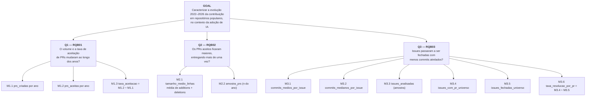

# Relatório — Laboratório de Experimentação de Software

| Campo | Valor |
|---|---|
| **Curso** | Engenharia de Software |
| **Disciplina** | Laboratório de Experimentação de Software |
| **Turno / Período** | Noite / 6º |
| **Professor(a)** | Danilo Maia |
| **Laboratório** | Lab01 — Características de Repositórios Populares + Setup do Kanban |
| **Grupo (trio)** | [Integrante 1] · [Integrante 2] · [Integrante 3] |
| **Link do repositório / GitHub Projects** | [preencher — obrigatório] |
| **Data de entrega** | [preencher] |

---

## 1. Introdução

Sistemas open-source populares concentram grande parte da atenção da comunidade de engenharia de software, mas as características que de fato os tornam populares — maturidade, ritmo de contribuição externa, frequência de lançamentos, atualização e escolha de linguagem — nem sempre são evidentes sem uma análise sistemática. Este laboratório analisa uma amostra de 100 repositórios populares do GitHub, respondendo às sete Questões de Pesquisa (RQ01–RQ07) definidas no enunciado na medida em que os atributos foram coletados.

> **Atenção às duas bases de dados.** As RQ01–RQ07 e as RQV01–RQV02 foram respondidas sobre a amostra de **100 repositórios**; as Questões de Pesquisa Bônus (RQB01–RQB03), apresentadas adiante nesta seção, foram respondidas sobre os **1000 repositórios** mais populares, porque analisam séries anuais que exigem volume maior para serem estáveis. Cada tabela da Seção 4 indica qual base gerou os seus números.

As Questões de Pesquisa do enunciado são:

- **RQ01.** Sistemas populares são maduros/antigos? (idade do repositório)
- **RQ02.** Sistemas populares recebem muita contribuição externa? (total de pull requests aceitas)
- **RQ03.** Sistemas populares lançam releases com frequência? (total de releases)
- **RQ04.** Sistemas populares são atualizados com frequência? (tempo até a última atualização)
- **RQ05.** Sistemas populares são escritos nas linguagens mais populares? (linguagem primária)
- **RQ06.** Sistemas populares possuem um alto percentual de issues fechadas? (razão issues fechadas/total)
- **RQ07.** Sistemas em linguagens mais populares recebem mais contribuição, lançam mais releases e são atualizados com mais frequência? (RQ02, RQ03 e RQ04 por linguagem)

Hipóteses informais do grupo, confrontadas com a amostra disponível:

- **RQ01:** espera-se que os repositórios populares tenham histórico relativamente longo.
- **RQ02:** espera-se que repositórios populares apresentem contribuição externa relevante.
- **RQ03:** espera-se que a maioria possua releases, embora com frequências diferentes.
- **RQ04:** espera-se que a maior parte tenha recebido push recentemente.
- **RQ05:** espera-se que as linguagens observadas estejam entre as mais utilizadas no ecossistema.
- **RQ06:** espera-se que uma parcela relevante das issues esteja fechada.
- **RQ07:** espera-se que as métricas de contribuição, releases e atualização variem entre linguagens.

As hipóteses de RQ02, RQ05, RQ06 e RQ07 não podem ser confrontadas com este arquivo, pois seus atributos não estão presentes no CSV.

Além do enunciado, o grupo propôs duas Questões de Pesquisa de Validação (RQV1 e RQV2) e duas Questões de Pesquisa Bônus (RQB01 e RQB02). As de primeiro tipo são voltadas não às características dos repositórios em si, mas à confiabilidade do próprio pipeline de coleta de dados construído para responder às RQ01–RQ07, já as segundas buscam analisar impactos na adoção de ferramentas de Inteligência Artificial à cultura de desenvolvimento. Seguem as questões em detalhe:

- **RQV01** — A extração via API GraphQL do GitHub cobre a totalidade dos itens esperados, sem lacunas de paginação, e produz resultados idênticos em execuções repetidas nas mesmas condições?
- **RQV02** — A extração via API GraphQL do GitHub evita chamadas HTTP redundantes e recupera-se corretamente de falhas transitórias (5xx) via retry, sem contabilizar a tentativa de recuperação como uma chamada redundante?
- **RQB01** — Com enfoque em criação e aceitação de Pull Requests, como a adoção de ferramentas de Inteligência Artificial tem impactado contribuições em projetos open-source nos últimos quatro anos?
- **RQB02** — Com o auxílio de ferramentas de Inteligência Artificial, nos últimos quatro anos, Pull Requests têm tido um aumento em quantidade de linhas de código, consequentemente atendendo um maior número de pendências de uma vez?
- **RQB03** — Como consequência da agilização do processo de desenvolvimento, fruto do uso de IAs, issues têm sido fechadas com uma menor quantidade de commits atrelados?

O detalhamento da metodologia usada para validação dos requisitos adicionais se encontra na Seção 3.6.

---

## 2. Contexto

Este relatório documenta o Lab01 da disciplina, primeiro laboratório do semestre, que também dá início ao uso do GitHub Projects (v2) como quadro Kanban do grupo, mantido até o Lab05. O objeto de estudo são repositórios populares do GitHub, minerados via API GraphQL complementada por chamadas REST. O arquivo analisado nas RQ01–RQ07 é [repositorios_top100.csv](../lab01-coleta/repositorios_top100.csv), com 100 registros; as questões bônus usam os arquivos `tendencia_prs.csv`, `tendencia_tamanho_prs.csv` e `commits_por_issue.csv`, gerados sobre os 1000 repositórios mais populares.

Como o CSV analisado não possui a linguagem primária dos repositórios, RQ05 e RQ07 não são respondidas nesta versão do relatório. Consequentemente, não foi necessário selecionar uma fonte externa de ranking de linguagens para interpretar os dados disponíveis.

Como base metodológica para a validação da confiabilidade do pipeline de coleta (RQV01 e RQV02), o grupo utilizou cenários de teste de comportamento (BDD) escritos em Cucumber/Gherkin, executados contra a API real do GitHub sob o perfil `realtest`, tratando o próprio processo de extração de dados como objeto de verificação, e não apenas os dados extraídos.

---

## 3. Metodologia

### 3.1 Principais Desafios

- Limite de taxa (rate limit) da API do GitHub ao consultar a amostra de 100 repositórios.
- Paginação de grandes volumes de dados, exigindo verificação explícita de que o laço de coleta respeita o indicador `hasNextPage` sem gerar chamadas adicionais após seu término.
- Falhas transitórias (respostas 5xx) não são reproduzíveis de forma determinística contra a API real: não é possível garantir que uma página específica falhará com `502` na primeira tentativa, o que limitou a validação empírica do mecanismo de retry a um cenário de execução sem falhas.
- Mistura de registros no `CallLog`: como o cenário de idempotência compara duas execuções da mesma coleta usando o mesmo registro de chamadas, a métrica de redundância passa a misturar a repetição esperada da segunda execução com possíveis duplicidades internas, exigindo leitura cuidadosa por execução lógica.
- Divergências observadas em execuções anteriores entre o XML do Cucumber e o resumo do Surefire, exigindo que os artefatos de relatório sejam sempre coletados a partir da mesma execução antes de qualquer comparação.
- Ausência de histórico de mudança de status consultável via API no GitHub Projects, exigindo snapshots manuais recorrentes a cada sprint.

### 3.2 Tomadas de Decisão

- O cenário original que induzia uma resposta `502` determinística foi substituído por um cenário de execução real sem falhas, já que a API real do GitHub não permite garantir a ocorrência controlada de um erro 502 na primeira tentativa — a recuperação determinística desse caso não é apresentada como evidência validada nesta execução.
- As métricas de validação do pipeline (`total_chamadas`, `chamadas_unicas`, `chamadas_redundantes`, `tentativas_de_retry`, `taxa_redundancia`, `cobertura_paginacao_pct`, `taxa_idempotencia_pct`) foram definidas e registradas em formato longo por cenário no arquivo `metricas.csv`, permitindo comparação cenário a cenário.
- A execução dos testes reais foi isolada por meio de tags Cucumber (`@real` e `not @mock`) e do perfil Spring `realtest`, com autenticação via `GITHUB_TOKEN` carregado de um arquivo `.env`, nunca reproduzido no relatório.
- Limite de WIP definido para a coluna Doing: 2 itens, para evitar trabalho paralelo excessivo e manter as tarefas em revisão antes de iniciar novas atividades.

### 3.3 Etapas

O processo seguiu a estrutura de sprints definida no enunciado (Lab01S01 a S03 + Relatório Final). A validação automatizada do pipeline de coleta (RQV1/RQV2) foi tratada como parte do trabalho de S03, antes da consolidação da análise das RQ01–RQ07.

| Sprint | Entregas | Responsável(is) | Issues (nº) |
|---|---|---|---|
| Lab01S01 | Consulta GraphQL para 100 repositórios; requisição automática; GitHub Projects criado com colunas e limite de WIP definidos. | Grupo | A definir no board |
| Lab01S02 | Paginação para a amostra de 100 repositórios; dados exportados em CSV; primeira versão do relatório com hipóteses informais; board atualizado com primeiro snapshot. | Grupo | A definir no board |
| Lab01S03 | Análise descritiva dos atributos disponíveis; validação automatizada do pipeline de coleta (cenários RQV01/RQV02) como inovação metodológica. | Grupo | A definir no board |
| Relatório Final | Elaboração do documento final, incluindo print do board e política de WIP em uso. | Grupo | A definir no board |

**Configuração do processo**

Colunas do board (campo Status): `Backlog → To Do → Doing → Review → Done`.

Política de limite de WIP para a coluna Doing: no máximo dois itens simultaneamente. Uma nova tarefa só entra em `Doing` quando uma tarefa existente avançar para `Review` ou `Done`.

> *[inserir aqui o print do quadro Kanban (GitHub Projects) ao final do laboratório]*

### 3.4 Ferramentas

- Java 21 e Maven, para o script de coleta e a suíte de testes.
- Spring Boot, como framework de aplicação e gestão de perfis de execução (perfil `realtest`).
- Cucumber, para os cenários de comportamento (BDD) que validam paginação, idempotência, ausência de chamadas redundantes e comportamento de retry.
- API GraphQL do GitHub, como fonte primária de coleta, complementada por chamadas REST — consulta e consumo implementados em script próprio do grupo, sem bibliotecas de terceiros para acesso à API.
- GitHub Projects (v2), como ferramenta de processo, com board vinculado ao repositório do grupo.

- Shell/AWK, para a conferência do número de registros e o cálculo das estatísticas descritivas apresentadas neste relatório.
- Editor de planilhas ou ferramenta equivalente, caso o grupo produza gráficos posteriormente.

### 3.5 Tabela de Métricas

A tabela abaixo relaciona cada Questão de Pesquisa do enunciado à sua métrica, definição operacional e ferramenta de coleta.

| RQ | Métrica | Definição Operacional | Unidade | Ferramenta / Fonte |
|---|---|---|---|---|
| RQ01 | Idade do repositório | Diferença entre a data da coleta e a data de criação | Meses | `idade_meses` no CSV, via GraphQL |
| RQ02 | Total de pull requests aceitas | Contagem de PRs com estado "merged" no repositório | Nº de PRs | Não coletada neste CSV |
| RQ03 | Total de releases | Contagem de releases publicadas no repositório | Nº de releases | `total_releases` no CSV, via GraphQL |
| RQ04 | Tempo até a última atualização | Diferença entre a data da coleta e o último push | Dias | `dias_desde_ultimo_push` no CSV, via GraphQL |
| RQ05 | Linguagem primária de cada repositório | Linguagem principal reportada pela API | Categórica | Não coletada neste CSV |
| RQ06 | Razão entre issues fechadas e total de issues | `issues_fechadas / issues_totais` | Percentual | Não coletada neste CSV |
| RQ07 | RQ02, RQ03 e RQ04 segmentadas por linguagem | Métricas agrupadas pela linguagem primária | Conforme métrica de origem | Não calculável sem linguagem e PRs |

A tabela seguinte apresenta as métricas adicionais definidas pelo grupo para validar a confiabilidade do pipeline de coleta (RQV1 e RQV2), detalhadas na Seção 3.6.

| RQ | Métrica | Definição Operacional | Unidade | Ferramenta / Fonte |
|---|---|---|---|---|
| RQV01 | `cobertura_paginacao_pct` | `itens_coletados / itens_esperados × 100` | % | CallLog / ColetaSteps.java (Cucumber) |
| RQV01 | `taxa_idempotencia_pct` | Percentual de itens iguais, por posição, entre duas execuções | % | CallLog / ColetaSteps.java (Cucumber) |
| RQV02 | `chamadas_redundantes` | Requisições que repetem uma assinatura HTTP já registrada | Nº de chamadas | CallLog.java |
| RQV02 | `taxa_redundancia` | `chamadas_redundantes / total_chamadas` | Proporção | CallLog.java |
| RQV02 | `tentativas_de_retry` | Repetições associadas a uma chamada que falhou (5xx) | Nº de tentativas | GitHubGraphQLClient.java |

A tabela seguinte apresenta as métricas das Questões de Pesquisa Bônus (RQB01–RQB03), organizadas segundo a árvore GQM da Seção 3.6.1. Diferentemente das RQ01–RQ07, todas cobrem o intervalo de 2022 a 2026 e são reportadas por ano, não por repositório.

| RQ | Métrica | Definição Operacional | Unidade | Ferramenta / Fonte |
|---|---|---|---|---|
| RQB01 | `prs_criadas`, `prs_aceitas` | Contagens anuais de PRs criados e de PRs com merge | Nº de PRs | `tendencia_prs.csv`, via GraphQL |
| RQB01 | `taxa_aceitacao` | `prs_aceitas / prs_criadas` | % | Derivada do mesmo CSV |
| RQB02 | `tamanho_medio_linhas` | Média de `additions + deletions` dos PRs aceitos amostrados no ano | Linhas | `tendencia_tamanho_prs.csv`, via GraphQL |
| RQB03 | `commits_medios_por_issue` | Soma dos commits dos PRs que fecharam as issues amostradas, dividida pelo nº de issues amostradas | Commits/issue | `commits_por_issue.csv`, via GraphQL |
| RQB03 | `commits_medianos_por_issue` | Mediana da mesma amostra | Commits/issue | `commits_por_issue.csv`, via GraphQL |
| RQB03 | `taxa_resolucao_por_pr` | `issues_com_pr_universo / issues_fechadas_universo` — contagens totais da população, não amostradas | % | Derivada do mesmo CSV |

A RQB03 é a única métrica do trabalho reportada com média **e** mediana. A decisão foi tomada a partir de evidência, não por precaução: no piloto de validação, o ano de 2025 apresentou média de 8,32 commits por issue contra 2,15 em 2024, mas a mediana dos dois anos era praticamente a mesma (2,0 e 1,0). O pico era efeito de uma única issue fechada por um Pull Request muito grande. Reportar apenas a média teria produzido, no texto final, a descrição de um fenômeno que não existe.

### 3.6 Inovações Propostas pelo Grupo (30% da nota)

Como contribuição além do enunciado, o grupo tratou o próprio pipeline de coleta de dados como objeto de verificação, e não apenas como um meio de obter os dados das RQ01–RQ07. Foram propostas duas Questões de Pesquisa de Validação (RQV01 e RQV02), avaliadas por meio de cenários automatizados de teste de comportamento (Cucumber) executados contra a API real do GitHub, com o perfil `realtest` e o comando:

```bash
cd lab01-coleta
set -a
source .env
set +a

mvn clean \
  -Dspring.profiles.active=realtest \
  -Dcucumber.filter.tags="@real and not @mock" \
  test
```

O relatório Surefire dessa execução registrou oito cenários analisados, cinco executados, três ignorados (pertencentes à funcionalidade de fallback, não interpretados como resultados desta execução), nenhuma falha e nenhum erro.

**Reprodutibilidade da coleta das RQBs.** A execução da RQB03 sobre os 1000 repositórios ocorreu em 27/08/2026, encerrando às 19:14 (BRT), com `AMOSTRA_ISSUES_COMMITS=10`, lotes de 10 combinações e nenhum lote perdido por falha da API. As três coletas de tendência são controladas por propriedades de configuração (`coletar-tendencia-prs`, `coletar-tamanho-prs`, `coletar-commits-por-issue`), o que permitiu executar a RQB03 isoladamente sem alterar o código: o padrão da aplicação continua sendo a coleta completa das três métricas.

Os requisitos adicionais propostos tem, como principal objetivo, analisar o impacto que a adoção de ferramentas de inteligência artificial tem tido na cultura de desenvolvimento e nos hábitos de desenvolvedores. Todos os requisitos adicionais cobrem um período de quatro anos de ciclos de desenvolvimento — de 2022 à 2026 — compreendidos pelo grupo como intervalo capaz de englobar o início da popularização do uso de IA até seu atual estado de uso constante e proeminente observável hoje em dia.

**RQV01** está relacionada à completude e à reprodutibilidade da coleta, e foi avaliada por três cenários: coleta de 100 repositórios com páginas de 10; encerramento natural quando `hasNextPage` é falso; e duas execuções da mesma coleta com os mesmos parâmetros.

**RQV02** está relacionada ao uso eficiente da API e à resiliência da coleta diante de falhas transitórias, e foi avaliada por dois cenários reais: coleta sem falhas e sem chamadas redundantes; e coleta real sem falhas e sem tentativas de retry desnecessárias.

A instrumentação dessas métricas está implementada em `ColetaSteps.java`, `Hooks.java` e `CallLog.java` (asserções) e em `GitHubGraphQLClient.java` (tratamento de retry para respostas 5xx). Os resultados obtidos e sua discussão aparecem nas Seções 4.1, 4.3 e 5.

### 3.6.1 Árvore GQM das questões bônus

As três Questões de Pesquisa Bônus derivam de um único objetivo de medição, formalizado abaixo no template GQM (*Goal–Question–Metric*) de Basili. A formalização é necessária porque, diferentemente das RQ01–RQ07, cujas métricas vêm do enunciado, as métricas das RQBs foram definidas pelo próprio grupo: a árvore torna explícito por que cada medida responde à pergunta que se propõe a responder, e quais medidas são de controle e não de resultado.

**Goal.** Analisar o histórico de contribuição (Pull Requests e issues) de repositórios open-source populares, com o propósito de caracterizar sua evolução ao longo do tempo, com respeito ao volume e ao tamanho das contribuições aceitas e ao esforço em commits associado ao fechamento de issues, do ponto de vista de engenheiros de software, no contexto dos 1000 repositórios mais populares do GitHub entre 2022 e 2026 — intervalo que abrange a popularização das ferramentas de Inteligência Artificial generativa aplicadas ao desenvolvimento.



**Métricas de resultado e métricas de controle.** Nem toda métrica da árvore responde à pergunta: algumas existem para impedir que as outras sejam mal lidas.

| Métrica | Papel |
|---|---|
| M1.3, M2.1, M3.1, M3.2 | **Resultado** — respondem diretamente às questões |
| M2.2, M3.3 | **Controle** — tamanho da amostra que sustenta cada média |
| M3.6 | **Controle** — que fatia das issues fechadas a M3.1 descreve |

A M3.6 é a mais importante das três de controle. A média de commits por issue (M3.1) cobre apenas as issues fechadas com Pull Request vinculado, e essa fatia **varia entre os anos**. Sem reportar M3.6 ao lado, uma variação em M3.1 poderia ser lida como mudança no esforço de desenvolvimento quando, na verdade, é mudança na forma como as issues passaram a ser fechadas. As duas são, por isso, sempre reportadas juntas — na tabela de resultados e no gráfico da Seção 4.2.

---

## 4. Resultados

### 4.1 Coleta de Dados

O arquivo [repositorios_top100.csv](../lab01-coleta/repositorios_top100.csv) possui 100 registros de repositórios e sete colunas: `nome`, `estrelas`, `idade_meses`, `total_releases`, `ultimo_push`, `ultima_atualizacao` e `dias_desde_ultimo_push`. A coleta foi realizada em 26 de agosto de 2026, conforme as datas presentes nos registros.

#### Perfil descritivo da amostra

| Indicador | Resultado |
|---|---:|
| Repositórios analisados | 100 |
| Soma de estrelas | 18.702.049 |
| Média de estrelas | 190.152,10 |
| Mediana de estrelas | 164.575 |
| Menor número de estrelas | 111.839 |
| Maior número de estrelas | 543.186 |
| Idade média | 88,40 meses |
| Mediana da idade | 95,50 meses |
| Idade mínima/máxima | 0 / 203 meses |
| Média de releases | 241,63 |
| Mediana de releases | 15 |
| Releases mínima/máxima | 0 / 6.957 |
| Repositórios sem release | 40 (40%) |
| Push nos últimos 30 dias | 81 (81%) |
| Mediana de dias desde o último push | 0 dias |
| Maior intervalo desde o último push | 792 dias |

O repositório com mais estrelas na amostra é `codecrafters-io/build-your-own-x`, com 543.186 estrelas, e o menor valor observado é de `browser-use/browser-use`, com 111.839 estrelas. Os maiores totais de releases foram observados em `ggml-org/llama.cpp` (6.957), `vercel/next.js` (3.823), `electron/electron` (1.991), `langchain-ai/langchain` (1.340) e `openai/codex` (1.020).

Esses dados respondem descritivamente às dimensões de idade, releases e recência, mas não permitem avaliar contribuição externa, linguagens ou issues, pois essas variáveis não aparecem no arquivo.

Como evidência de que o pipeline executou a coleta da amostra de 100 repositórios, a validação automatizada (RQV01/RQV02) registrou os seguintes resultados nos cenários de paginação e idempotência:

**Paginação (por cenário)**

| Métrica | Valor por cenário |
|---|---:|
| `total_chamadas` | 15 |
| `chamadas_unicas` | 15 |
| `chamadas_redundantes` | 0 |
| `tentativas_de_retry` | 0 |
| `taxa_redundancia` | 0,0 |

**Idempotência (duas execuções)**

| Métrica | Valor |
|---|---:|
| `taxa_idempotencia_pct` | 100,0% |
| `total_chamadas` | 4 |
| `chamadas_unicas` | 2 |
| `chamadas_redundantes` | 2 |
| `tentativas_de_retry` | 0 |
| `taxa_redundancia` | 0,5 |

A igualdade entre `total_chamadas` e `chamadas_unicas` nos cenários de paginação indica ausência de repetição registrada nas chamadas observadas, e o teste confirmou que nenhuma requisição adicional ocorreu após `hasNextPage = false`. As duas chamadas redundantes do cenário de idempotência correspondem à segunda execução da mesma coleta compartilhando o `CallLog`, não a duplicidade interna da paginação.

Para os cenários reais de coleta sem falhas, o CSV de métricas registrou zero chamadas redundantes, taxa de redundância igual a zero e `tentativas_de_retry = 0`, valor compatível com uma execução em que a API respondeu normalmente — o que demonstra ausência de necessidade de recuperação, mas não comprova o funcionamento do retry após uma resposta `502`.

#### Questões de Pesquisa Bônus — base de 1000 repositórios

As RQB01–RQB03 usam uma base distinta das RQ01–RQ07: os **1000 repositórios** mais populares, e não os 100 descritos acima. Os resultados abaixo são agregados por ano, não por repositório.

**RQB03 — Commits por issue fechada.** Coleta de 27/08/2026, 19:14 (BRT). Parâmetros: amostra de 10 issues por repositório/ano, 5.000 combinações repositório × ano em 500 requisições, 46 minutos de execução, **nenhum lote perdido**. Arquivo `commits_por_issue.csv`.

| Ano | Média | Mediana | Issues amostradas | Issues fechadas | Fechadas com PR | Taxa de resolução por PR |
|---|---:|---:|---:|---:|---:|---:|
| 2022 | 3,96 | **2,0** | 3.851 | 367.632 | 75.130 | 20,44% |
| 2023 | 6,31 | **2,0** | 4.510 | 452.401 | 90.612 | 20,03% |
| 2024 | 8,36 | **2,0** | 4.626 | 475.827 | 98.012 | 20,60% |
| 2025 | 4,95 | **2,0** | 4.913 | 503.194 | 101.346 | 20,14% |
| 2026 | 7,11 | **2,0** | 5.810 | 551.499 | 155.372 | 28,17% |

As colunas "Issues fechadas" e "Fechadas com PR" são contagens totais da população, não amostras; a média e a mediana cobrem apenas as 23.710 issues amostradas entre as fechadas com Pull Request vinculado. O ano de 2026 é parcial (coleta em 27 de agosto).

Para a leitura conjunta da Seção 4.3, os resultados já coletados das outras duas questões bônus, na mesma base de 1000 repositórios:

| Ano | PRs criados | PRs aceitos | Taxa de aceitação | Tamanho médio do PR aceito |
|---|---:|---:|---:|---:|
| 2022 | 535.174 | 379.790 | 70,97% | 1.235,08 linhas |
| 2023 | 680.814 | 478.973 | 70,35% | 1.642,13 linhas |
| 2024 | 807.694 | 578.173 | 71,58% | 1.295,41 linhas |
| 2025 | 930.951 | 638.150 | 68,55% | 2.258,02 linhas |
| 2026 | 1.262.393 | 698.534 | 55,33% | 2.548,91 linhas |

### 4.2 Visualização Gráfica

Não foram incluídos gráficos nesta versão. A análise foi apresentada em tabelas descritivas porque o CSV contém apenas 100 registros e quatro dimensões analíticas principais: estrelas, idade, releases e recência do push. Gráficos para RQ02, RQ05, RQ06 e RQ07 exigiriam dados que não estão presentes no arquivo.

Para RQV01 e RQV02, os resultados são binários/percentuais por cenário (aprovado/reprovado, percentuais de idempotência e redundância) e foram reportados diretamente nas tabelas da Seção 4.1, sem necessidade de visualização gráfica adicional.

Para a RQB03, recomenda-se um gráfico de linha com duas séries — mediana de commits por issue e taxa de resolução por PR, esta em eixo secundário —, cobrindo 2022 a 2026. A segunda série é o que impede o leitor de interpretar uma mudança na população medida como mudança no esforço de desenvolvimento. Um gráfico de apenas uma série seria, neste caso, uma linha reta em 2,0: visualmente pobre, mas é precisamente esse o resultado.

### 4.3 Discussão

As conclusões abaixo referem-se exclusivamente à amostra de 100 registros do CSV.

**RQ01 — Sistemas populares são maduros/antigos?**

Parcialmente confirmada. A idade média foi de 88,40 meses e a mediana foi de 95,50 meses, aproximadamente 7,4 e 8,0 anos, respectivamente. A amplitude foi de 0 a 203 meses, indicando que a amostra reúne tanto projetos muito recentes quanto projetos com histórico superior a 16 anos. A mediana e a média sugerem predominância de repositórios com histórico relevante, mas não permitem afirmar que todos os sistemas populares sejam antigos.

**RQ02 — Sistemas populares recebem muita contribuição externa?**

Não respondida. O CSV não possui a contagem de pull requests aceitas ou qualquer variável equivalente de contribuição externa.

**RQ03 — Sistemas populares lançam releases com frequência?**

Parcialmente confirmada. A média foi de 241,63 releases, mas a mediana foi de apenas 15 e 40% dos repositórios não tinham release registrada. A diferença entre média e mediana mostra uma distribuição assimétrica, influenciada por poucos projetos com valores muito altos, como `ggml-org/llama.cpp`, com 6.957 releases. Portanto, a existência de releases é comum em parte da amostra, mas não se pode dizer que a maioria lance releases em alta frequência sem uma medida temporal de frequência.

**RQ04 — Sistemas populares são atualizados com frequência?**

Parcialmente confirmada. Oito em cada dez repositórios (81%) tiveram push nos 30 dias anteriores à coleta, e a mediana de dias desde o último push foi 0. Entretanto, houve registro com até 792 dias sem push, mostrando que a atualização não é uniforme em toda a amostra.

**RQ05 — Sistemas populares são escritos nas linguagens mais populares?**

Não respondida. A linguagem primária não foi coletada.

**RQ06 — Sistemas populares possuem alto percentual de issues fechadas?**

Não respondida. O CSV não contém o total de issues nem a quantidade de issues fechadas.

**RQ07 — Sistemas em linguagens mais populares recebem mais contribuição, lançam mais releases e são atualizados com mais frequência?**

Não respondida. A comparação exigiria, no mínimo, linguagem primária, pull requests aceitas e agrupamento das métricas por linguagem, que não estão disponíveis no arquivo.

**RQB03 — Issues têm sido fechadas com uma menor quantidade de commits atrelados?**

**Hipótese refutada.** A mediana de commits por issue fechada foi **exatamente 2,0 em todos os cinco anos** analisados, sem qualquer tendência de queda. Não há evidência, nesta amostra de 23.710 issues distribuídas por 1000 repositórios, de que issues tenham passado a ser resolvidas com menos commits no período de popularização das ferramentas de IA.

A estabilidade é o achado, e ela é notável: cinco anos, um universo de mais de 2,3 milhões de issues fechadas, e o valor central não se moveu uma única unidade. Se a adoção de IA alterou o processo de desenvolvimento — e as RQB01 e RQB02 indicam que algo mudou —, esse efeito **não aparece no número de commits necessários para fechar uma issue**.

A média, por sua vez, oscilou entre 3,96 e 8,36 sem direção definida (subiu em 2023 e 2024, caiu em 2025, subiu em 2026). Essa divergência entre média instável e mediana imóvel é, por si só, um resultado metodológico: indica distribuição fortemente assimétrica, em que poucas issues resolvidas por Pull Requests muito grandes deslocam a média do ano inteiro. **Qualquer leitura baseada apenas na média teria produzido conclusões falsas** — por exemplo, "o esforço por issue dobrou entre 2022 e 2024", afirmação que a mediana desmente por completo. Foi exatamente esse risco, detectado durante a validação (Seção 3.5), que motivou a coleta da mediana.

**Leitura conjunta das três questões bônus.** Tomadas em conjunto, as RQBs desenham um quadro coerente e mais interessante do que qualquer uma isolada:

| Dimensão | 2022 | 2026 | Movimento |
|---|---:|---:|---|
| PRs criados (RQB01) | 535.174 | 1.262.393 | ↑ 136% |
| Taxa de aceitação (RQB01) | 70,97% | 55,33% | ↓ 15,6 p.p. |
| Tamanho médio do PR aceito (RQB02) | 1.235 linhas | 2.549 linhas | ↑ 106% |
| Commits por issue, mediana (RQB03) | 2,0 | 2,0 | — estável |

O volume de contribuições mais que dobrou e o tamanho dos PRs aceitos também, enquanto o número de commits por issue permaneceu constante. A implicação aritmética é direta: **os commits ficaram maiores**, não mais numerosos. A mesma quantidade de passos passou a carregar aproximadamente o dobro de código.

Esse padrão é compatível com um cenário de assistência automatizada à escrita de código — em que o desenvolvedor produz mais linhas por iteração sem alterar o número de iterações necessárias para resolver uma issue —, mas **é apenas compatível, não uma demonstração**. A queda simultânea na taxa de aceitação (de 71% para 55%) admite leitura oposta e igualmente plausível: um volume maior de contribuições de qualidade inferior, que os mantenedores passaram a rejeitar mais.

**Limitação central: a análise é correlacional, não causal.** Em nenhum momento a adoção de ferramentas de IA foi medida nos repositórios estudados — o ano-calendário é usado como *proxy* dessa adoção. Qualquer outro fenômeno do período (crescimento da automação de CI, mudança nas políticas de contribuição, atuação de bots, entrada de repositórios novos no topo do ranking) explica os mesmos dados igualmente bem. As RQBs descrevem **o que mudou** no ecossistema, não **por que** mudou.

**Ameaças à validade específicas da RQB03:**

1. **População restrita.** A métrica cobre apenas issues fechadas com Pull Request vinculado — entre 20% e 28% do total de issues fechadas. As demais foram fechadas sem código rastreável (duplicadas, dúvidas, *stale bots*) e estão fora da medição. A métrica de controle `taxa_resolucao_por_pr` foi reportada justamente para tornar essa fatia visível.
2. **Mudança na fatia medida.** A taxa de resolução por PR foi estável entre 2022 e 2025 (20,0% a 20,6%), mas subiu para 28,17% em 2026. Como 2026 é ano parcial, não é possível distinguir efeito sazonal de mudança real de comportamento. Se a alta se confirmar, a população de 2026 difere das demais e a comparação direta com os outros anos fica enfraquecida.
3. **Amostragem não aleatória.** A API de busca do GitHub não oferece amostragem aleatória, e toda ordenação disponível introduz viés sistemático (verificado empiricamente: ordenar por data de criação seleciona faxina de backlog fechada por bots). A coleta usa a ordem de relevância padrão da API, que não é aleatória.
4. **Definição de "commits atrelados".** Conta-se `commits.totalCount` dos PRs que fecharam a issue, o que inclui *merges* e commits de correção de revisão. É deliberado — esses commits são parte do esforço de resolução —, mas afasta a métrica de uma contagem de "commits de implementação".
5. **Projetos fora do GitHub Issues.** Repositórios que usam outros rastreadores (`django/django`, via Trac) ou listas de discussão (`torvalds/linux`) não contribuem com issues para a amostra. Não é falha de coleta, e sim característica real da população.
6. **Teto de 10 Pull Requests por issue.** Issues resolvidas por mais de dez PRs têm o esforço subestimado. São raras e o efeito é desprezível diante da mediana.

**RQV01 — completude e reprodutibilidade**

Os testes apoiam parcialmente a RQV01: a paginação percorreu as páginas observadas sem repetir chamadas, a coleta encerrou corretamente após a indicação de ausência de próxima página, e duas execuções produziram resultados idênticos, com idempotência de 100%. A hipótese de completude, no entanto, não pode ser considerada totalmente comprovada apenas com esses artefatos, pois o cenário de paginação executado verifica somente que pelo menos um repositório foi coletado — não há comparação explícita entre `itens_coletados` e `itens_esperados`, e a métrica `cobertura_paginacao_pct` não apareceu no CSV desta execução.

**RQV02 — eficiência e resiliência**

Os resultados também apoiam parcialmente a RQV02: não foram observadas chamadas redundantes nas coletas normais, não houve retry desnecessário quando a API não falhou, e a coleta real terminou com sucesso. A propriedade mais específica da hipótese — que uma resposta `502` é seguida por exatamente um retry bem-sucedido — não foi validada nesta execução, pois essa condição exige uma falha reproduzível que não pode ser garantida usando somente a API real do GitHub. A ausência de `502` nos testes reais não deve ser interpretada como prova de que o mecanismo de retry foi de fato exercitado.

**Ameaças à validade específicas da inovação (RQV01/RQV02):**

1. Falha transitória não determinística: a API real não permite induzir um `502` na primeira tentativa de uma página; o teste real valida o comportamento normal, não a recuperação controlada.
2. Cobertura de paginação incompleta: o cenário usa a asserção "ao menos 1 repositório", em vez de exigir exatamente 100 itens.
3. Métrica de cobertura ausente: existe um step para calcular `cobertura_paginacao_pct`, mas essa métrica não aparece no CSV atual.
4. Idempotência por posição: a comparação usa o menor tamanho entre as listas; diferenças de tamanho podem não ser totalmente refletidas.
5. Mistura no `CallLog` entre as duas execuções do cenário de idempotência, gerando chamadas redundantes esperadas na segunda execução.
6. CSV em modo append: execuções sucessivas podem misturar resultados de diferentes rodadas se o arquivo não for limpo antes da coleta.
7. Escopo das chamadas: `total_chamadas` inclui chamadas GraphQL e REST; avaliar exclusivamente a paginação GraphQL exige filtrar pelo endpoint `/graphql`.
8. Variação da API real: estrelas, datas e releases podem mudar entre execuções — a idempotência observada vale para as condições registradas, não como garantia permanente do estado do GitHub.

As inovações do grupo (Seção 3.6) acrescentam, ao restante do relatório, uma camada de confiança metodológica: antes de interpretar os resultados disponíveis de RQ01–RQ07 como reflexo fiel do estado do GitHub, o grupo verificou — com evidência automatizada, embora parcial — que o próprio processo de coleta não perde itens por paginação incompleta nem infla artificialmente o uso da API com chamadas redundantes.

---

## 5. Conclusão

A análise foi limitada a 100 repositórios e às variáveis efetivamente presentes no arquivo coletado. Para essa amostra, RQ01, RQ03 e RQ04 foram analisadas de forma descritiva; RQ02, RQ05, RQ06 e RQ07 não puderam ser respondidas por ausência dos atributos necessários.

Quanto à validação do pipeline de coleta: a execução real forneceu evidências favoráveis de que o pipeline percorre as páginas observadas sem repetir chamadas, respeita o encerramento indicado por `hasNextPage = false`, produz resultados idênticos em duas execuções nas mesmas condições observadas, e não registra chamadas redundantes nem retries em uma coleta normal sem falhas.

Em relação às RQ01–RQ07, a amostra apresenta repositórios com idade mediana de 95,50 meses, mediana de 15 releases e 81% de repositórios atualizados nos últimos 30 dias. Esses resultados indicam maturidade e atividade recente em boa parte da amostra, mas a grande variação nos totais de releases recomenda o uso da mediana junto da média. Não há dados suficientes para conclusões sobre pull requests, linguagens ou issues.

A RQV01 foi atendida parcialmente, com evidência de paginação sem repetição e idempotência de 100%, mas ainda sem comprovação explícita de cobertura percentual de 100% dos itens esperados. A RQV02 também foi atendida parcialmente: a ausência de chamadas redundantes foi observada e o comportamento normal foi bem-sucedido, porém a recuperação específica de uma falha `502` não foi exercitada pela API real e, portanto, não pode ser declarada validada com base nesta execução.

Quanto às questões bônus, coletadas sobre 1000 repositórios: a **RQB03 teve sua hipótese refutada**. A mediana de commits por issue fechada foi constante em 2,0 ao longo de todo o período de 2022 a 2026, sem qualquer tendência de redução. Lida junto das RQB01 e RQB02, a estabilidade ganha significado: no mesmo período em que o volume de Pull Requests e o tamanho médio dos PRs aceitos mais que dobraram, o número de commits necessários para fechar uma issue não se moveu — indicando commits maiores, e não mais numerosos. Reforça-se que o ano é apenas uma *proxy* da adoção de ferramentas de IA, não uma medida dela, e que nenhuma relação causal pode ser extraída destes dados.

Registra-se também um resultado metodológico da RQB03: a média anual oscilou entre 3,96 e 8,36 enquanto a mediana permanecia imóvel. Caso o grupo tivesse reportado apenas a média — decisão adotada nas demais métricas deste laboratório —, o relatório teria descrito uma variação de esforço que não existe. Fica a recomendação, para os próximos laboratórios, de que métricas com distribuição de cauda longa sejam sempre reportadas com média e mediana lado a lado.

Com mais tempo, o grupo expandiria essa inovação simulando a API do GitHub (mock de respostas 502) para validar deterministicamente o mecanismo de retry, e adicionaria a asserção explícita de `cobertura_paginacao_pct = 100%` ao cenário de paginação, hoje limitado à verificação de "ao menos 1 repositório".

---

## 5. Referências

- ZUSE, Horst. A framework of software measurement. Walter de Gruyter, 2013.
- *[demais referências usadas — ex.: documentação da API GraphQL do GitHub, documentação do Cucumber, fonte de linguagens mais populares para RQ05]*


